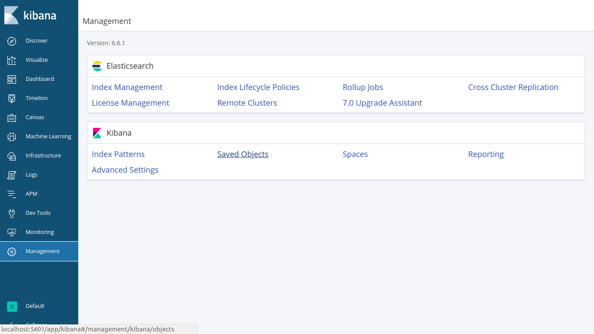

# WAF ELK docker image

## Setup ELK

Best to set up after MISP has been set up

* Create and populate the env file
  
  ```bash
  cd ~/Honeypot-Project/honeytraps/waf_elk
  cp ./misp-push/sample-env ./misp-push/env
  ```
  
  In the env file change the URL_MISP field to the IP MISP is be running on
  
  Change the MISP_KEY to your own API key. It can be found after you logged into MISP in Home>Automation section here:
  
  

Change all elasticsearch IPs to the IP that ELK will be running at the docker-compose.yml file

* Build image
  
  ```bashag-0-1dttmup1hag-1-1dttmup1h
  docker-compose build
  # Start containers
  ./start_docker.sh
  ```

* Import Setings into Kibana
  
  - Open [http://localhost:5601/app/kibana](http://localhost:5601/app/kibana) in your browser
  
  - Go to Management in Kibana Dashboard and click Saved Objects 
    
    
  
  - Click on Import and upload the export.ndjson file as shown in below figure located in ```Honeypot-Project/honeytraps/waf_elk/kibana/export.json```  
    
      

## Running ELK

Run the script - it simply sets vm.max_map_count to the correct value before starting the docker image.

```bash
cd ~/Honeypot-Project/honeytraps/waf_elk
./start_docker.sh
```

## Accessing ELK

* Kibana can be accessed on [http://localhost:5601/app/kibana](http://localhost:5601/app/kibana)
